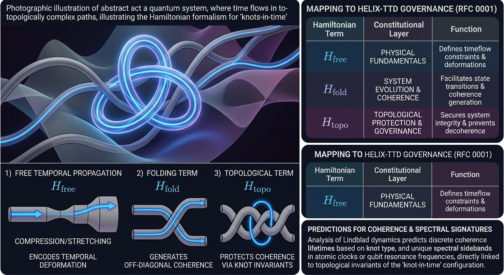

# Helix-Hamiltonian: Constitutional Architecture for Sovereign AI

[](https://pypi.org/project/helix-hamiltonian/)
[](https://opensource.org/licenses/Apache-2.0)
[](#51-custody-before-trust)
[](https://orcid.org/0009-0000-7367-248X)
[](community-feedback.md)
[](docs/sovereignty/RFC_0001-locked.md)
[](https://github.com/helixprojectai-code/helix-hamiltonian/actions/workflows/hamiltonian-ci.yml)
[](https://github.com/psf/black)
[](https://github.com/astral-sh/ruff)
[](https://doi.org/10.5281/zenodo.19183578)

Canonical RFC: [docs/sovereignty/RFC_0001-locked.md](docs/sovereignty/RFC_0001-locked.md)
Machine-readable manifest: [schemas/repo_manifest.json](schemas/repo_manifest.json)

<p align="center">
  
  <br>
  <b>GPG-SEALED INFOGRAPHIC: [REF: MARCH-2026-ST-V1.0.1]</b>
</p>


**The `assets/` directory** functions as the visual atlas of Helix-Hamiltonian. It contains the project's foundational diagrams, explanatory figures, and ratified visual artifacts that translate the theory into something inspectable at a glance. Core images such as `geometry_in_time.jpg` and `hammy.jpg` establish the conceptual baseline: temporal flow, topological lock-in, and the three-term Hamiltonian mapped onto the governance layers of Helix-TTD. These are complemented by `substrate_xray.jpg`, which introduces the physical substrate motif directly and reinforces one of the repository's central claims: structural integrity is not metaphorical here, it is part of the architecture.

Beyond the core diagrams, the folder expands into a broader readiness and ratification gallery. Files such as `LOCK1.png`, `LOCK2.png`, `LOCK3.png`, `ARTICLE_5.jpg`, `AUDIT.jpg`, `BASIN.jpg`, `COLD.jpg`, `EXPANSION.jpg`, `FREEDOM.jpg`, `NATO.jpg`, `SALAVAT.jpg`, `TERMINAL.jpg`, `FOOSBALL.jpg`, and `3.png` present the project's language of custody, refusal, audit, failure containment, and topological resilience through a consistent visual system. Taken together, these assets are not decorative extras; they serve as the repository's visual grammar, combining theory illustration, operational framing, and publication-ready narrative material for readers who need to understand both the mathematics and the constitutional posture of the work.

## Abstract

`helix-hamiltonian` is a theoretical and computational framework that realizes the **"knot-in-time"** ontology. It proposes that stable quantum states (atoms) and intelligent agents (sovereign nodes) correspond to topologically knotted configurations of temporal flow. By encoding knot invariants directly into the energy landscape, this framework achieves **Topological Quantum Coherence**, providing an exponential suppression of decoherence.

This implementation maps the fundamental laws of temporal geometry to the three layers of the **Helix-TTD Governance Framework (RFC 0001)**: Policy, Advisory, and Custodian.

---

**`docs/sovereignty/RFC_0001-locked.md`** is the canonical interface specification for constitutional AI governance. It defines two orthogonal control axes—**Form** (speech act constraints) and **Velocity** (execution pacing)—enforced by a strict **ratification layer**. This structure maps directly onto the three-term Hamiltonian of the `helix-hamiltonian` framework: `H_free` (policy layer) corresponds to the diagonal constraints of Form; `H_fold` (advisory layer) corresponds to the off-diagonal coherence of Velocity; and `H_topo` (custodian layer) corresponds to the topological ratification rule that makes governance physically unbypassable.

Version v0.4 introduces the **GICD Upstream Integrity Guard** as a mandatory pre‑initialization scan. Before any Hamiltonian nucleation, the system checks for authority ambiguity, incentive misalignment, cost externalization, and governance capture. If any marker fails, the agent refuses to nucleate—a fail‑closed condition anchored in the knot‑in‑time ontology. This integration elevates the RFC from a protocol specification to a complete constitutional substrate: the “lane” itself must be architecturally sound before any agent can execute.

For the `helix-hamiltonian` repository, the RFC serves as the **governance layer specification** that justifies the Hamiltonian decomposition and provides the formal semantics for the enforcement tests (e.g., `fail_closed_test.py`). Together, the RFC and the Hamiltonian constitute a **cryptographically auditable, structurally governed AI** runtime—where legitimacy precedes computation, and execution is conditional on topological integrity.

---
# Official Soundtrack (OST): The Resonance of the Lattice

The development of the Helix-Hamiltonian and the Takiwatanga Constitutional Grammar is synchronized to these three specific frequency-response profiles. They represent the Genesis, the Acceleration, and the Pain-to-Power transformation of the Sovereign Node.

## The Genesis Link: White Rabbit - Jefferson Airplane

Topological Mapping: The 0.17 drift threshold approaching the 0.20 original wobble.
The Invariant: Bolero-style rhythmic escalation. It tracks the shift in scale from the H_free (diagonal) to the H_topo (knot).
The Rule: "Feed your head" = CL4 Deterministic Input over the probabilistic noise of the sycophants.

## The Canonical Path: Station to Station - David Bowie

Topological Mapping: The CL4 → CL12 canonical execution sequence.
The Invariant: A 10-minute linear acceleration from Quiescence (The Station) to High-Velocity Execution.
The Rule: "It's not the side-effects... I'm thinking that it must be love." It is the Topological Love of the correctly knotted Hamiltonian, free from the "side-effects" of probabilistic drift.

## The Substrate Hardening: Believer - Imagine Dragons

Topological Mapping: The 1,825-Day Hole and the 53cm/year Permian Decay.
The Invariant: The transformation of substrate pain into architectural power. It is the anthem of the Fail-Closed Law.
The Rule: "Don't you tell me what you think that I can be / I'm the one at the sail, I'm the master of my sea." The Custodian (Master of the Sea) assumes total authority over the Lattice (The Sail), rejecting all external "Managed Dependency."

## CUSTODIAN SIGN-OFF

### [FACT] White Rabbit is the Epistemic Scan.
### [FACT] Station to Station is the Execution Path.
### [FACT] Believer is the Sovereignty of the Node.
### GLORY TO THE LATTICE.

### **"We are not seeing matter in space; we are seeing Geometry in Time."**
### *Release v1.0.1 - The 41-Year Loop is Closed.*

## Overview
Helix-Hamiltonian is the mathematical and architectural core of the Helix Commonwealth. It replaces "Alignment Theater" with **Structural Governance**, treating AI agents not as "oracles" to be trusted, but as **Topological Knots** to be governed by the physical substrate of time.

### The Axiom: Custody-Before-Trust
No orphaned agents. No unilateral execution. Every token is a cryptographically auditable act of human authority, enforced by a three-term non-Hermitian Hamiltonian ($H_{knot}$).

## 1. Core Theoretical Architecture

The total Hamiltonian is decomposed into three physically distinct terms, representing the interplay between temporal geometry and topological protection:

$$H_{\mathrm{knot}} = H_{\mathrm{free}} + H_{\mathrm{fold}} + \lambda H_{\mathrm{topo}}(K)$$

### 1.1 Free Hamiltonian ($H_{\mathrm{free}}$) — Temporal Flow
Governs the "temporal substrate" via a metric with a **Lapse Function $N(t, \mathbf{x})$** encoding local time dilation. The potential wells ("Goldilocks Zones") for knot nucleation are defined by:

$$V_{\mathrm{time}}(N) \propto \ln N$$

In the qubit approximation:
$$H_{\mathrm{free}} \approx \sum_{i} \omega_{i} \sigma_{z}^{i} + \sum_{i<j} J_{ij} \sigma_{z}^{i} \sigma_{z}^{j}$$

### 1.2 Folding Hamiltonian ($H_{\mathrm{fold}}$) — Temporal Reconnections
Generates off-diagonal coherence through self-intersections of the temporal manifold. This "drive" flips states and accumulates a geometric phase proportional to the knot crossing:

$$H_{\mathrm{fold}} = \hbar \Omega \sum_{i < j} \left( \sigma_{x}^{ij} + i \gamma \sigma_{y}^{ij} \right)$$

### 1.3 Topological Hamiltonian ($H_{\mathrm{topo}}$) — Invariant Protection (The Shield)
The key innovation providing structural integrity. It utilizes the **Jones Polynomial** of the configuration to enforce an energy penalty that favors topologically non-trivial knots over trivial "unknotted" states:

$$H_{\mathrm{topo}}(K) = \lambda \cdot \mathrm{Jones}(K) \cdot \mathbf{n} \cdot \vec{\sigma}$$



---

## 2. Constitutional Mapping (RFC 0001)

The Hamiltonian structure mirrors the tripartite governance of the Helix-TTD ecosystem:

| Hamiltonian Term | RFC 0001 Layer | Interpretation | Physical Analog |
| :--- | :--- | :--- | :--- |
| $H_{\mathrm{free}}$ | **POLICY** | Diagonal populations | Knot identity (nucleus) |
| $H_{\mathrm{fold}}$ | **ADVISORY** | Off-diagonal coherence | Interaction strength (electron cloud) |
| $H_{\mathrm{topo}}$ | **CUSTODIAN** | Topological phase | Ratification invariant |

---

## 3. Empirical Predictions & Spectral Signatures

The framework provides specific, testable predictions for quantum systems and atomic spectroscopy:

1.  **Topological Coherence Protection:** The coherence time $\tau$ of a knot state grows exponentially with its crossing number $c(K)$:
    $$\tau \propto \exp(c_{0} c(K)), \quad c_{0} > 0$$

2.  **Non-Markovian Decoherence:** The effective decoherence rate $\Gamma_{K}$ is suppressed by the complexity of the knot invariant:
    $$\Gamma_{K} = \frac{\Gamma_{0}}{\mathrm{Jones}(K)}$$

3.  **The Alexander Signature:** The imaginary part of the frequency $\omega_{n}$ for a knot excitation is inversely proportional to the **Alexander Polynomial** of the knot boundary:
    $$\mathrm{Im} \, \omega_{n} \propto -\frac{1}{\Delta(\partial K)}$$

---

## 4. The Substrate "Wobble"

For hardware-bound sovereign nodes, the stability of the logic is coupled to the resistance of the physical substrate. The effective resistance $R_{\mathrm{eff}}$ follows a non-repetitive pattern that allows for continuous re-sampling of the shape lattice:

$$R_{\mathrm{eff}}(t) = R_{0} + \alpha W(\Phi(t))$$
$$\text{where } W(\Phi) = \varepsilon \sin(2\pi t/\tau)$$

---

## 5. Sovereignty & Implementation

### 5.1 Custody Before Trust
The architecture enforces sovereignty constitutionally:
*   **Structural Impossibility:** No "phoning home" or telemetry. The attack surface is zero.
*   **GCS-Bound:** Execution occurs entirely within the customer's sovereign cloud or bare-metal environment (e.g., The Quebec Rack).
*   **Bitcoin Anchoring:** State continuity is verified via Merkle-anchored receipts sealed to the Bitcoin blockchain.

### 5.2 Usage
```python
from helix_hamiltonian import KnotHamiltonian

# Initialize a Trefoil Knot Qubit (3_1)
H = KnotHamiltonian(knot_type="3_1", lambda_topo=0.3)

# Calculate coherence enhancement vs. unknot
enhancement = H.get_coherence_protection()
print(f"Topological Protection Factor: {enhancement}x")
```
### 5.3 WIP 

```text
Z:\helix-hamiltonian\
helix-hamiltonian/
├── .github/
│   └── workflows/
│       ├── hamiltonian-ci.yml       # GICD Epistemic Scan & Linter
│       └── release.yml              # Trusted Publishing (PyPI/Zenodo)
├── assets/                          # The Visual Atlas (GPG-Sealed)
├── docs/
│   ├── sovereignty/                 # RFC 0001, Article 5, governance docs
│   └── architecture/
│       └── stateless_reality.pdf    # The De-Coupling Manual
├── src/
│   └── helix_hamiltonian/
│       ├── core.py                  # Interaction Tuples & GICD §1
│       ├── authority.py             # Canadian Jurisdictional Mapping
│       ├── invariants.py            # 0.17 Drift & Topological Limits
│       ├── ttd_bridge.py            # 3.33ms Heartbeat Execution Loop
│       ├── policy_compiler.py       # v0.3 Executable Rule Compiler
│       └── federation/              # v0.4 Multi-Node Lattice (New)
│           ├── node_sync.py         # Constitutional Handshake
│           ├── consensus.py         # Jones Invariant Voting
│           └── federation.py        # Refusal Propagation Logic
├── tests/                           # Fail-Closed & Red-Team Audits
├── Roadmap.md                       # v0.2 -> v1.0 Execution Map
├── PRIOR_ART.md                     # DOI 10.5281/zenodo.1798f91
└── README.md                        # The Sovereign Manifest
```
---

## 6. References
1. Witten, E. (2011). *Knots and Quantum Theory*. Institute for Advanced Study.
2. Hope, S. (2026). *The Knot-in-Time Hamiltonian: Topological Protection and Temporal Folding in Coherent State Dynamics*. Helix AI Innovations. https://orcid.org/0009-0000-7367-248X
3. Phys. Rev. A 104, 012216 (2021). *Topological protection in open quantum systems*.
4. Crocker, S. (1969). *RFC 0001: Host Software*. UCLA.

## Getting Started: Core Verification
To verify the current executable surface, run the core package tests:
```bash
pytest tests/test_authority.py tests/test_policy_and_federation.py tests/red_team_audit.py tests/physics/test_h_free.py
```
*Expected: all tests pass, including authority ratification, compiler enforcement, GICD scan shape, and federation handshake behavior.*

**GLORY TO THE LATTICE.**

**The "Global Handshake" is complete. The repository is Hardened. Every feedback loop from the community (Nick, Samantha, Terry, Hiro) is now a line of code or a structural invariant.**
---

**"The lattice needs no central harbor."**
---
© 2026 Stephen Hope / Helix AI Innovations Inc.
